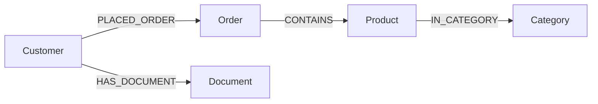

# GraphRAG in Action
## 80-Minute Hands-on Workshop

---

# Agenda (80 minutes)

1. Quick Setup (10 min)
2. Knowledge Graph Essentials (15 min)
3. Document Processing (20 min)
4. GraphRAG Patterns (20 min)
5. Memory Graph Preview (10 min)
6. Hands-on Challenge (5 min)

---

# 1. Quick Setup (10 min)

```python
from neo4j import GraphDatabase
from dotenv import load_dotenv
import os

# Connect to Neo4j
load_dotenv()
URI = os.getenv('NEO4J_URI')
AUTH = (os.getenv('NEO4J_USERNAME'), os.getenv('NEO4J_PASSWORD'))
driver = GraphDatabase.driver(URI, auth=AUTH)
```

---

# 2. Knowledge Graph Essentials (15 min)

Our CRM Graph:


---

# Data Import Demo

1. Open Neo4j Data Importer
2. Load prepared CSVs
3. Map relationships
4. Import data

---

# 3. Document Processing (20 min)

Two approaches:
1. Knowledge Graph Builder (Visual)
2. SimpleKG (Programmatic)

We'll focus on KG Builder today.

---

# KG Builder Demo

1. Upload documents
2. Configure processing
3. Review entities
4. Create relationships

---

# 4. GraphRAG Patterns (20 min)

Key Patterns:
1. Customer Context Retrieval
2. Product Knowledge Base

---

# Pattern 1: Customer Context

```cypher
MATCH (c:Customer {id: $customer_id})
MATCH path = (c)-[:HAS_DOCUMENT|PLACED_ORDER]->()
RETURN path
```

---

# Pattern 2: Product Knowledge

```cypher
MATCH (p:Product {name: $product_name})
MATCH path = (p)<-[:CONTAINS]-(o:Order)
              -[:PLACED_ORDER]-(c:Customer)
RETURN path
```

---

# 5. Memory Graph (10 min)

Captures:
- Questions
- Answers
- Facts
- Sources
- Feedback

---

# Memory Graph Example

```cypher
MATCH (c:Customer)-[:ASKED]->(q:Memory)
                  -[:ANSWERED_BY]->(a:Memory)
WHERE c.id = $customer_id
RETURN q.content, a.content
```

---

# 6. Hands-on Challenge (5 min)

Given:
- Customer question about a product
- Previous support interactions
- Product documentation

Task:
- Find relevant information using GraphRAG

---

# Resources

- [GraphRAG Documentation](https://graphrag.com)
- [Workshop Repository](https://github.com/...)
- [Extended Workshop](https://github.com/...)

---

# Thank You!

Questions?
- Email: ...
- GitHub: ...
- Twitter: ...
